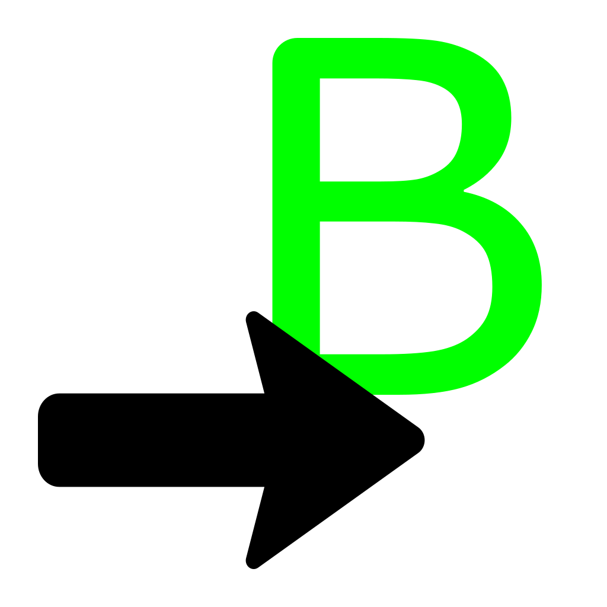

# Godot-ButlerExportPlugin

> A Godot plugin that provides an interface for [itch.io](https://itch.io)'s [`butler`](https://itch.io/docs/butler/) utility in the Godot editor.

A plugin that provides an interface for [butler](https://itch.io/docs/butler/)'s [push](https://itch.io/docs/butler/pushing.html) functionality for Godot exports, allowing for automatic uploading or new builds.

This plugin supports Godot v4.5 and higher. Godot v4.4 is no longer supported as of v2.0.0.0 .

## Dependencies

This plugin requires a local copy of [butler downloaded](https://itchio.itch.io/butler/) to the system in order to operate.

Requires the [NovaTools](https://github.com/NovaDC/Godot-Novatools "NovaTools Github Repository") (v1.4 or higher) plugin as a dependency.
[NovaTools](https://github.com/NovaDC/Godot-Novatools "NovaTools Github Repository") does not need to be enabled for this plugin to function.

## FAQ

### Whats butler?

Butler can be [downloaded from here](https://itchio.itch.io/butler).

Butler is [itch.io](https://itch.io)'s tools that, amongst other things, allows for automated uploading to [itch.io](https://itch.io).

[You can read more here.](https://itch.io/docs/butler/)

### It says "Butler executable path not set!" / How do I install butler?

If you don't already have butler installed, [you must do so first](#dependencies).

Once you have butler extracted, you must the set the godot **editor** setting `filesystem/tools/butler/butler_path` to the location of the butler executable.

This plugin does not currently support retrieving butler's location from `PATH` variables - it must be a real filesystem path, relative or absolute.

### It says that the game page doesn't exist

Make sure that you create the [itch.io](https://itch.io) page for you game *before* using butler.
This ensures that the channels are set properly as well as other settings.
Currently, butler does not have the ability to create a new game for an [itch.io](https://itch.io) account.

### Why did new browser windows just open?

There are 2 likely situations where browser windows would be opened.

If it's a login or authentication page, thats because you forgot to login using butler. Follow the instructions in the opened terminal to log in.

If it's the game's itch.io, make note that setting the option to open the game page will happen *per export preset*. It's best to leave that option disabled until you need it, and to disable all but one if your exporting multiple presets at once.

### Why are web exports not supported?

Currently, due to a bug in Godot ([#115994](https://github.com/godotengine/godot/issues/115994)), export plugin's settings set for web platforms will replace the settings set for all other platforms types.

The code related to web exports already exists in this plugin, its only disabled as of right now. As soon as this bug is resolved, support will be reenabled.

### What about beeps4life support?

Sadly, the scope of this project is limited. One must take solace in the acknowledgment that, sometimes, even critical features must be cut.
